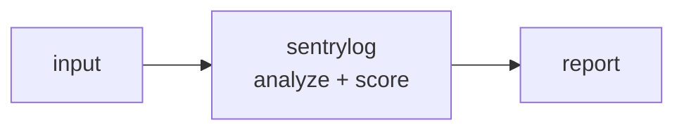

<a name="top"></a>
<div align="center">


# SENTRYLOG

### Single-file SIEM for small teams — Sigma rules + multi-source ingest


[](https://pypi.org/project/cognis-sentrylog/) [](https://github.com/cognis-digital/sentrylog/actions) [](LICENSE) [](https://github.com/cognis-digital)

*Blue Team / Defense — detection, deception, and monitoring for small teams.*

</div>

```bash
pip install cognis-sentrylog
sentrylog scan .            # → prioritized findings in seconds
```


<!-- cognis:example:start -->
## 🔎 Example output

Real, reproducible output from the tool — runs offline:

```console
$ sentrylog-emit --version
sentrylog 1.0.0
```

```console
$ sentrylog-emit --help
usage: sentrylog [-h] [--version] [--format {table,json}]
                 {scan,summary,rules,rule} ...

Sigma-style detection engine over JSON/CSV logs (MITRE ATT&CK mapped).

positional arguments:
  {scan,summary,rules,rule}
    scan                run rules against a log file
    summary             rollup of findings by technique/level
    rules               list bundled detection rules
    rule                show one rule in detail

options:
  -h, --help            show this help message and exit
  --version             show program's version number and exit
  --format {table,json}
                        output format (default: table)
```

```console
$ sentrylog-emit rules
28 rules loaded
  [critical] cloud-aws-stoptrail      T1562.008    AWS CloudTrail Logging Stopped
  [critical] cred-lsass-dump          T1003.001    LSASS Process Access Dump
  [critical] cred-mimikatz            T1003.001    Mimikatz Credential Dumping Keywords
  [critical] impact-vss-delete        T1490        Shadow Copy Deletion (Ransomware Precursor)
  [high    ] cloud-aws-open-sg        T1562.007    AWS Security Group Opened to World
  [high    ] cloud-aws-root           T1078.004    AWS Root Account Usage
  [high    ] def-clear-eventlog       T1070.001    Clear Windows Event Logs
  [high    ] def-disable-defender     T1562.001    Disable Windows Defender via Registry or PowerShell
  [high    ] exec-office-child-shell  T1059.003    Office Application Spawning Shell
  [high    ] exec-regsvr32-sct        T1218.010    Regsvr32 Squiblydoo
  [high    ] exec-rundll32-js         T1218.011    Rundll32 Suspicious Execution
  [high    ] ingress-certutil         T1140        Certutil Download or Decode
  [high    ] linux-reverse-shell      T1059.004    Linux Reverse Shell One-Liner
  [high    ] persist-net-localadmin   T1136.001    User Added to Local Administrators Group
  [high    ] web-sqli                 T1190        Web SQL Injection Probe
  [high    ] win-ps-download-cradle   T1059.001    PowerShell Download Cradle
  [high    ] win-ps-encoded           T1059.001    Suspicious PowerShell Encoded Command
  [medium  ] ingress-bitsadmin        T1197        BITSAdmin Download
  [medium  ] lateral-psexec           T1569.002    PsExec Service Execution
  [medium  ] lateral-wmic-process     T1047        WMI Process Creation Lateral Movement
  [medium  ] linux-cron-persist       T1053.003    Linux Persistence via Cron
  [medium  ] linux-sensitive-read     T1003.008    Linux Sensitive File Read
  [medium  ] linux-ssh-bruteforce     T1110.001    SSH Brute Force Failed Logins
  [medium  ] persist-new-service      T1543.003    New Service Installed via sc.exe
  [medium  ] persist-run-key          T1547.001    Run Key Persistence via reg.exe
  [medium  ] persist-schtasks         T1053.005    Scheduled Task Creation for Persistence
  [medium  ] web-path-traversal       T1190        Web Path Traversal Attempt
  [low     ] net-suspicious-port      T1571        Outbound Connection to Suspicious Port
```

> Blocks above are real `sentrylog` output — reproduce them from a clone.

<!-- cognis:example:end -->

## Usage — step by step

1. **Install** the CLI (console script `sentrylog`):
   ```bash
   pip install cognis-sentrylog
   ```
2. **Scan logs against the bundled Sigma-style rules** — `scan` accepts JSON, JSON-lines, or CSV (`-` for stdin) and exits `1` when there are findings:
   ```bash
   sentrylog scan events.jsonl
   ```
3. **Narrow the rule set / inspect rules** — filter by minimum severity, list bundled rules, or load a custom pack:
   ```bash
   sentrylog rules --level high
   sentrylog rule <rule-id>
   sentrylog scan events.jsonl --rules my_rules.yml --level medium
   ```
4. **Roll up and read the output** — `summary` aggregates findings by MITRE technique and level; emit JSON for a SIEM:
   ```bash
   sentrylog summary events.jsonl --format json | jq '.by_technique'
   ```
5. **Automate in CI** — gate on detections (nonzero exit = findings):
   ```yaml
   - run: pip install cognis-sentrylog
   - run: sentrylog scan logs/*.jsonl --level high
   ```

## Contents

- [Why sentrylog?](#why) · [Features](#features) · [Quick start](#quick-start) · [Example](#example) · [Architecture](#architecture) · [AI stack](#ai-stack) · [How it compares](#how-it-compares) · [Integrations](#integrations) · [Install anywhere](#install-anywhere) · [Related](#related) · [Contributing](#contributing)

<a name="why"></a>
## Why sentrylog?

Single-file SIEM for small teams — Sigma rules + multi-source ingest — without standing up heavyweight infrastructure.

`sentrylog` is single-purpose, scriptable, and self-hostable: point it at a target, get prioritized results in the format your workflow already speaks (table · JSON · SARIF), gate CI on it, and let agents drive it over MCP.

<div align="right"><a href="#top">↑ back to top</a></div>

<a name="features"></a>
## Features

- ✅ Load Rules Text
- ✅ Parse Rules
- ✅ Ingest Lines
- ✅ Ingest Text
- ✅ Detect
- ✅ Runs on Linux/macOS/Windows · Docker · devcontainer
- ✅ Ports in Python, JavaScript, Go, and Rust (`ports/`)

<div align="right"><a href="#top">↑ back to top</a></div>

<a name="quick-start"></a>
## Quick start

```bash
pip install cognis-sentrylog
sentrylog --version
sentrylog scan .                       # scan current project
sentrylog scan . --format json         # machine-readable
sentrylog scan . --fail-on high        # CI gate (non-zero exit)
```

<div align="right"><a href="#top">↑ back to top</a></div>

<a name="example"></a>
## Example

```text
$ sentrylog scan .
  [HIGH    ] SEN-001  example finding             (./src/app.py)
  [MEDIUM  ] SEN-002  another signal              (./config.yaml)

  2 findings · risk score 5 · 38ms
```

<div align="right"><a href="#top">↑ back to top</a></div>

<a name="architecture"></a>
## Architecture



<div align="right"><a href="#top">↑ back to top</a></div>

<a name="ai-stack"></a>
## Use it from any AI stack

`sentrylog` is interoperable with every popular way of using AI:

- **MCP server** — `sentrylog mcp` (Claude Desktop, Cursor, Cognis.Studio, [uncensored-fleet](https://github.com/cognis-digital/uncensored-fleet))
- **OpenAI-compatible / JSON** — pipe `sentrylog scan . --format json` into any agent or LLM
- **LangChain · CrewAI · AutoGen · LlamaIndex** — wrap the CLI/JSON as a tool in one line
- **CI / scripts** — exit codes + SARIF for non-AI pipelines

<div align="right"><a href="#top">↑ back to top</a></div>

<a name="how-it-compares"></a>
## How it compares

| | **Cognis sentrylog** | SigmaHQ |
|---|:---:|:---:|
| Self-hostable, no account | ✅ | varies |
| Single command, zero config | ✅ | ⚠️ |
| JSON + SARIF for CI | ✅ | varies |
| MCP-native (AI agents) | ✅ | ❌ |
| Polyglot ports (JS/Go/Rust) | ✅ | ❌ |
| Open license | ✅ COCL | varies |

*Built in the spirit of **SigmaHQ/sigma**, re-framed the Cognis way. Missing a credit? Open a PR.*

<div align="right"><a href="#top">↑ back to top</a></div>

<a name="integrations"></a>
## Integrations

Pipes into your stack: **SARIF** for code-scanning, **JSON** for anything, an **MCP server** (`sentrylog mcp`) for AI agents, and a webhook forwarder for SIEM/Slack/Jira. See [`docs/INTEGRATIONS.md`](docs/INTEGRATIONS.md).

<div align="right"><a href="#top">↑ back to top</a></div>

<a name="install-anywhere"></a>
## Install — every way, every platform

```bash
pip install "git+https://github.com/cognis-digital/sentrylog.git"    # pip (works today)
pipx install "git+https://github.com/cognis-digital/sentrylog.git"   # isolated CLI
uv tool install "git+https://github.com/cognis-digital/sentrylog.git" # uv
pip install cognis-sentrylog                                          # PyPI (when published)
docker run --rm ghcr.io/cognis-digital/sentrylog:latest --help        # Docker
brew install cognis-digital/tap/sentrylog                             # Homebrew tap
curl -fsSL https://raw.githubusercontent.com/cognis-digital/sentrylog/main/install.sh | sh
```

| Linux | macOS | Windows | Docker | Cloud |
|---|---|---|---|---|
| `scripts/setup-linux.sh` | `scripts/setup-macos.sh` | `scripts/setup-windows.ps1` | `docker run ghcr.io/cognis-digital/sentrylog` | [DEPLOY.md](docs/DEPLOY.md) (AWS/Azure/GCP/k8s) |

<div align="right"><a href="#top">↑ back to top</a></div>

<a name="related"></a>
## Related Cognis tools

- [`edrgap`](https://github.com/cognis-digital/edrgap) — EDR coverage & bypass detector — reconciles MDM + EDR + AD inventories
- [`canarynet`](https://github.com/cognis-digital/canarynet) — Self-hosted canary token network — AWS keys, DNS, docs, web URLs
- [`phishforge`](https://github.com/cognis-digital/phishforge) — Open-source phishing simulation — campaigns, templates, training
- [`sbomgate`](https://github.com/cognis-digital/sbomgate) — Continuous SBOM diff & vulnerability watch with maintainer-change tracking
- [`honeytrace`](https://github.com/cognis-digital/honeytrace) — Active-decoy network lure system — SSH, RDP, SMB, web honeypots

**Explore the suite →** [🗂️ all 170+ tools](https://github.com/cognis-digital/cognis-neural-suite) · [⭐ awesome-cognis](https://github.com/cognis-digital/awesome-cognis) · [🔗 cognis-sources](https://github.com/cognis-digital/cognis-sources) · [🤖 uncensored-fleet](https://github.com/cognis-digital/uncensored-fleet) · [🧠 engram](https://github.com/cognis-digital/engram)

<div align="right"><a href="#top">↑ back to top</a></div>

<a name="contributing"></a>
## Contributing

PRs, new rules, and demo scenarios are welcome under the collaboration-pull model — see [CONTRIBUTING.md](CONTRIBUTING.md) and [SECURITY.md](SECURITY.md).

> ### ⭐ If `sentrylog` saved you time, **star it** — it genuinely helps others find it.

## Interoperability

`{}` composes with the 300+ tool Cognis suite — JSON in/out and a shared
OpenAI-compatible `/v1` backbone. See **[INTEROP.md](INTEROP.md)** for the
suite map, composition patterns, and reference stacks.

## License

Source-available under the **Cognis Open Collaboration License (COCL) v1.0** — free for personal, internal-evaluation, research, and educational use; **commercial / production use requires a license** (licensing@cognis.digital). See [LICENSE](LICENSE).

---

<div align="center"><sub><b><a href="https://cognis.digital">Cognis Digital</a></b> · one of 170+ tools in the <a href="https://github.com/cognis-digital/cognis-neural-suite">Cognis Neural Suite</a> · <i>Making Tomorrow Better Today</i></sub></div>
